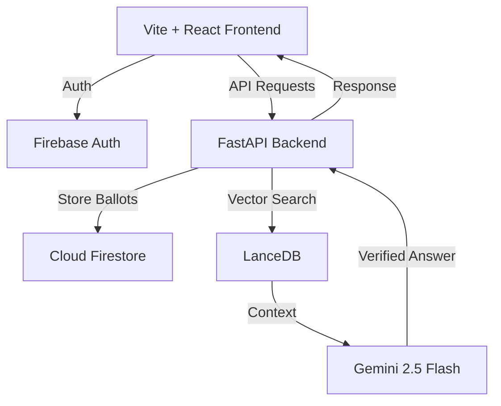

# 🗳️ Informed Poll

> **Empowering the next generation of voters with AI-driven civic clarity.**

[](https://github.com/seeramsujay/informed-poll)
[](https://cloud.google.com/vertex-ai)
[](https://lancedb.com/)
[](LICENSE)

**Informed Poll** is a high-fidelity, mobile-first election companion designed for first-time voters. It combines the intuitive "swipe" mechanics of modern social apps with a sophisticated **RAG (Retrieval-Augmented Generation)** engine to demystify complex political landscapes.

---

## 🚀 Live Demo
- **Frontend**: [informed-poll-frontend.run.app](https://informed-poll-frontend-51884867643.us-central1.run.app)
- **API**: [informed-poll-backend.run.app/docs](https://informed-poll-backend-51884867643.us-central1.run.app/docs)

---

## ✨ Key Features

### 🃏 Swipeable Candidate Cards
Tactical, gesture-driven interface for exploring candidates. Build your "Personal Ballot" with intuitive left/right swipes.

### 🧠 VoteIQ: Neural Sync RAG
A chatbot that doesn't hallucinate. Grounded in verified **Election Commission of India (ECI)** data using **LanceDB** and **Gemini 2.5 Flash**.

### 🗺️ Civic Dossier
A comprehensive, interactive timeline of the voting journey—from Form 6 registration to the polling booth protocol.

### 🔐 Secure & Non-Partisan
Stateless backend with Firebase Auth (OIDC) and Firestore for encrypted, private ballot storage.

---

## 🏗️ Architecture



For a deep dive into the system design, see [Archives/Architecture.md](Archives/Architecture.md).

---

## 🛠️ Tech Stack

- **Frontend**: React 18, Vite, Vanilla CSS (Kinetic Catalyst), Lucide Icons.
- **Backend**: FastAPI, Uvicorn, Python 3.11+.
- **Database**: 
  - **Firestore**: Transactional user data & voting state.
  - **LanceDB**: High-performance vector store for RAG.
- **AI/ML**: Vertex AI (Gemini 2.5 Flash) via `google-generativeai`.
- **Cloud**: Google Cloud Run (Serverless Containerized).

---

## ⚡ Quick Start

### Prerequisites
- Python 3.11+
- Node.js 18+
- Google Cloud Project with Vertex AI enabled

### Local Setup

1. **Clone & Install**
   ```bash
   git clone https://github.com/seeramsujay/informed-poll.git
   cd informed-poll
   pip install -r requirements.txt
   cd frontend && npm install
   ```

2. **Environment Variables**
   Create a `.env` in the root:
   ```env
   GOOGLE_API_KEY=your_gemini_key
   FIREBASE_PROJECT_ID=your_project_id
   ```

3. **Run Development Servers**
   - **Backend**: `python main.py` (Runs on port 8000)
   - **Frontend**: `cd frontend && npm run dev` (Runs on port 5173)

---

## 📚 Documentation
- [Architecture Deep Dive](Archives/Architecture.md)
- [API Reference](Archives/API.md)
- [Future Steps](Archives/Future_Steps.md)
- [Work Roadmap](lancedb/ROADMAP.md)
- [Product Vision](conductor/product.md)

---

## 🤝 Contributing
We welcome contributions! Please see [Archives/CONTRIBUTING.md](Archives/CONTRIBUTING.md) for guidelines.

---

## 📄 License
Distributed under the MIT License. See `LICENSE` for more information.

---

*Built with ❤️ for the Google Hackathon 2024.*
